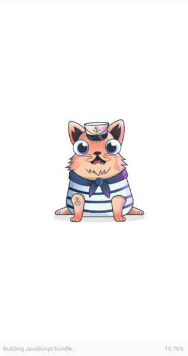
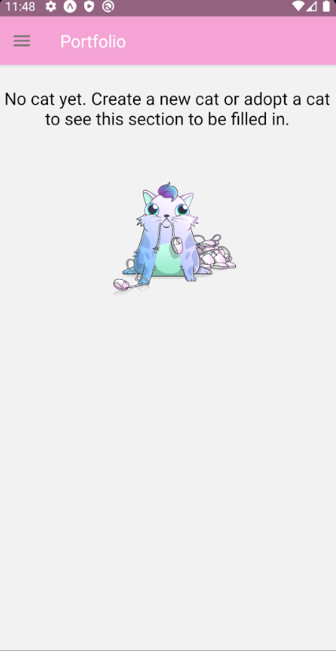
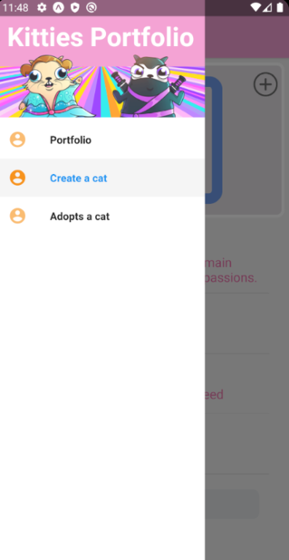
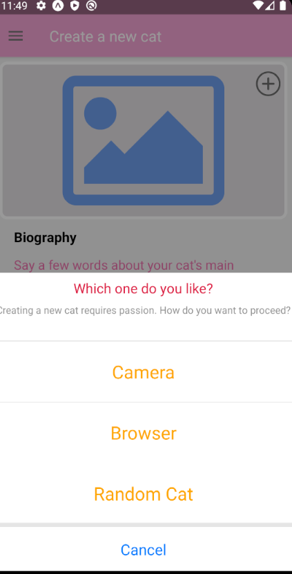
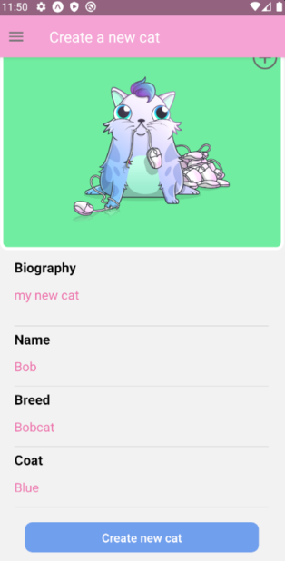
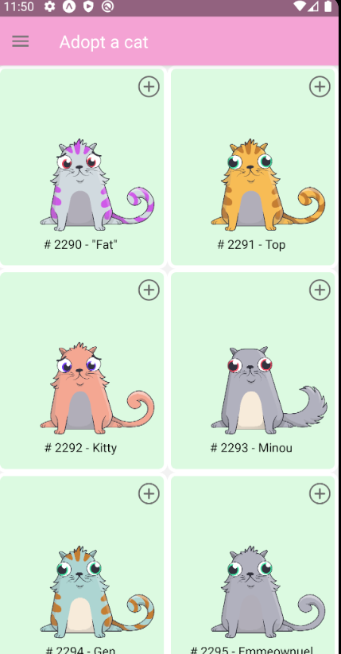
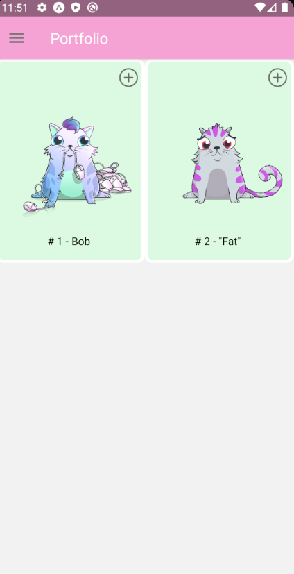
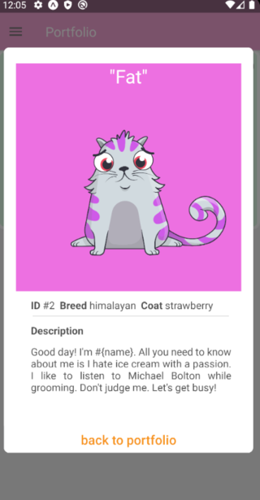
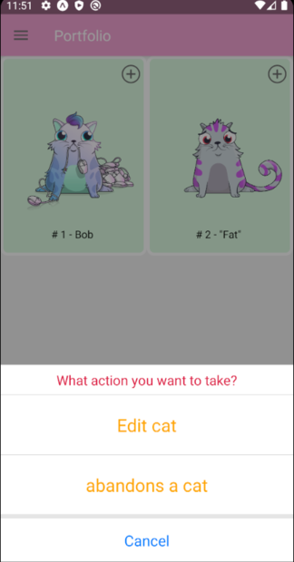
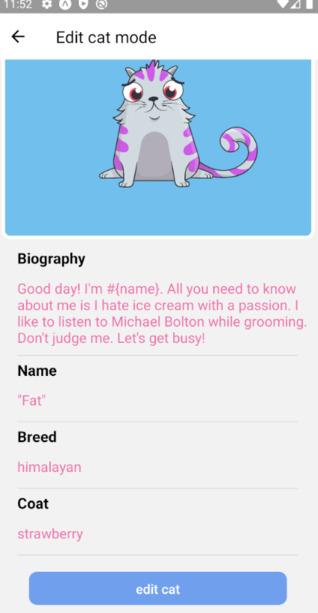

# Kitties App

Kitties is a native react cat profile management application.<br />













## Installation


```bash
git clone https://github.com/Cyf0x/kitties.git
cd kitties
npm install
npm start
```


## Try it on expo
<a href="https://expo.io/@kali00/kitties">https://expo.io/@kali00/kitties</a>

## Installation


```bash
git clone https://github.com/Cyf0x/kitties.git
cd kitties
npm install
npm start
```

## Application development structure

<h3>1. Navigation</h3>
The application is built with expo. It divides it into several main categories accessible by the user through a drawernavigator.
A stacknavigator allows to navigate between the different routes at the time of certain user choice.
The drawernavigator is encapsulated in a switchnavigator allowing the installation in the future of a connection interface.

